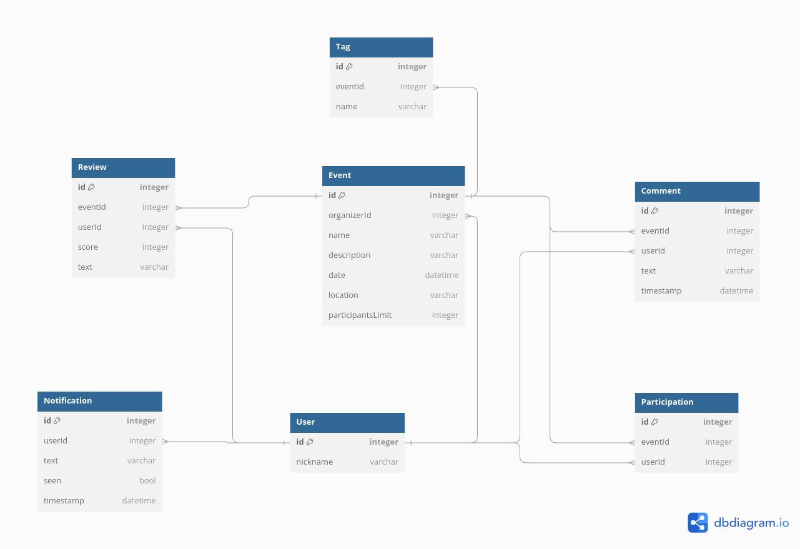
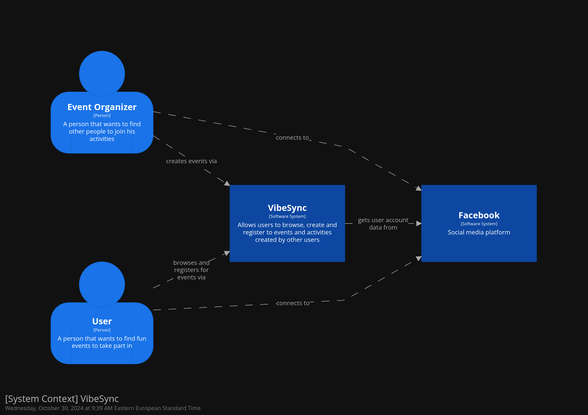
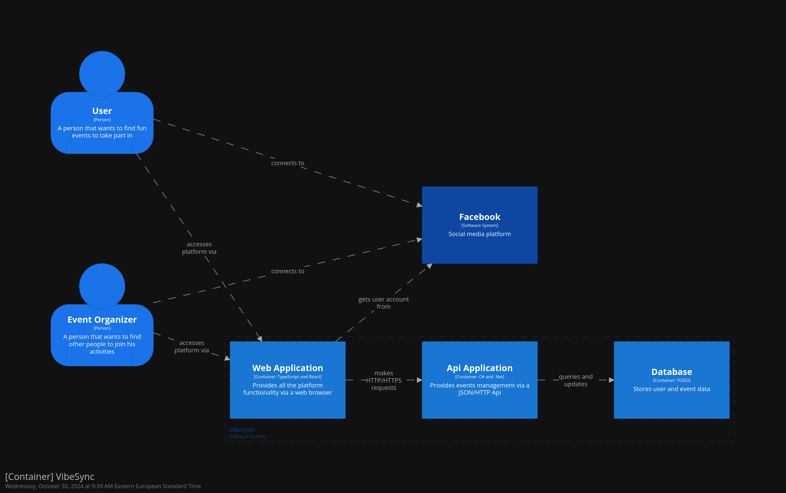
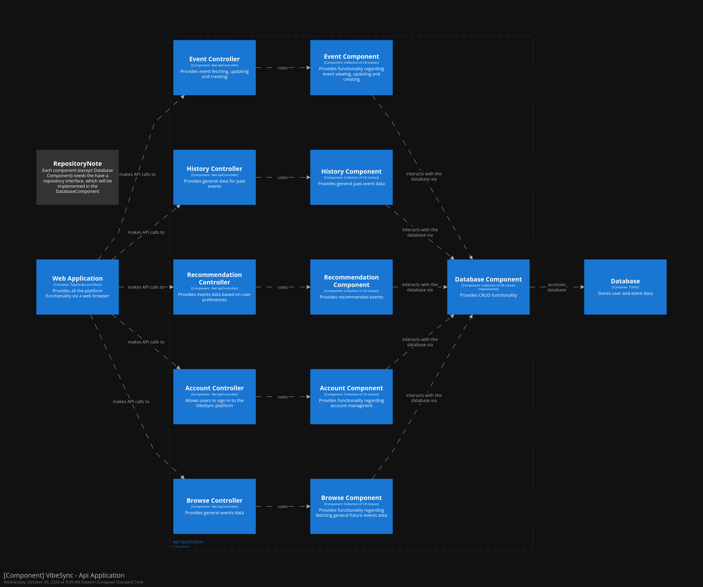

# Report

## Architecture Design

We began with our initial product feature, but as every vision is not crystal clear from the start, we recognized the need to refactor certain elements that had become redundant. Below, I will dive into these changes, comparing our initial architecture diagrams with the modifications we implemented.

### Diagrams and Comparisons

> Initial Database Diagram Architecture

The database structure remained unchanged, as it fully adhered to the initial design.

> Context of Application

The user and event organizer flows outlined in the initial context diagram were implemented without any modifications.

> Container Architecture

Similarly, the container architecture required no adjustments. Further details on the container structure can be found below in the [Microservices](#microservices) section.

This is where some key refactorings were made. Initially, certain components had tightly coupled logic, creating redundancies when attempting to separate them. After careful evaluation, we refactored the following:

- `HistoryController`: This controller was merged into the `EventService` as its logic required only a single function, entirely dependent on the `Events` model.

- `BrowseController`: Similarly, the `BrowseController` was integrated into the `EventsController`. Its functionality relied solely on the `Events` model and consisted of just one function, making separation unnecessary.

- `RecommendationController`: The `RecommendationController` introduced significant overhead for the application, especially since recommendations needed to be generated quickly and frequently. The previous approach, on the server side, required re-fetching events each time, which was inefficient. By moving the recommendation logic to the frontend, we could fetch the data once and then apply filtering logic using our heuristic algorithm locally. This eliminated the need for repeated fetches, improving performance and reducing backend load. The recommendations are now computed directly in the frontend container

These changes simplified the architecture by eliminating redundancy and improving component alignment.

### Microservices

Our architecture comprises four microservices: the database, backend, frontend, and the Facebook login serverless API.

The frontend service operates as a standalone application, while the backend and database must be contained together within the same Docker container. Each of these components is deployed on separate servers/machines and intercommunicate with each other. For instance, the database container is defined as a service within a custom network, with the backend service as another container in the same network, facilitating communication between them.

The Facebook login API enhances our security and manages frontend browser sessions.

### Repository-Service Pattern

To create a more robust, comprehensible, and implementable architecture, we decided to use the Repository-Service Design Pattern. This pattern helps maintain modularity in the code, preventing the separate services and components from becoming too tightly coupled. It also improves the readability of the project's structure.

This pattern offers several other advantages:

- **Testability:** By separating business logic and data access logic, it enhances the ability to unit test individual components.

- **Maintainability:** The modular nature of the pattern allows for easier updates and maintenance of the codebase without affecting other components.

- **Reusability:** Common functionality can be encapsulated within services and repositories, promoting code reuse across the application.

- **Scalability:** The clear separation of concerns allows for more straightforward scalability, as components can be individually optimized and scaled.

- **Consistency:** Promotes a consistent approach to data access and business logic implementation across the application.

## Quality Assurance (QA)

### Automated Tests

Automated testing involves using specialized software tools to execute pre-scripted tests on the application automatically. This includes various types of tests, such as unit tests, integration tests, and end-to-end tests, to ensure different aspects of the application function correctly.

To gain a better understanding of the automated tests, we thoroughly tested the Event Controller. 

#### Test Cases Overview

1. **GetFutureEvents** Tests:
    
    - **Positive** Test: Ensures that when future events exist, the method returns an `OkObjectResult` containing a list of event summaries.
    - **Negative** Test: Validates that when an exception occurs, the method returns a 500 Internal Server Error with the appropriate error message.

2. **GetEvent** Tests:

    - **Positive** Test: Checks if a detailed view of a specific event is correctly retrieved and returned as an `OkObjectResult`.
    - **Negative** Test: Ensures that exceptions during retrieval result in a 500 Internal Server Error response.

3. **CreateEvent** Tests:

    - **Positive** Test: Validates the creation of an event, ensuring a success message is returned when the request is valid.
    - **Negative** Test: Verifies that missing required fields result in a `BadRequestObjectResult` with a proper validation error message.

Considering our security measures used and the design patterns implemented, mocking proved to be an essential technique. For instance, all external services and repositories (`EventService`, `IConfiguration`, etc.) are mocked using `Moq` to isolate the `EventController` logic from its dependencies. By setting up specific behaviors in mocks, the tests simulate real-world scenarios. The `HttpContext` is mocked to simulate user authentication and provide necessary user information for certain methods like `CreateEvent`.

#### Benefits of These Tests

- **Maintainability**: With well-defined tests, future changes to the `EventController` can be implemented and validated quickly.

- **Reliability**: The automated tests enhance confidence in the controller's ability to handle a variety of real-world situations.

- **Error Prevention**: By covering both typical and atypical scenarios, these tests help prevent unexpected issues.

### UI/UX Responsiveness

Ensuring the user interface (UI) and user experience (UX) are responsive means making sure that the application is accessible and usable across a variety of devices and screen sizes. This involves testing how the UI adapts to different resolutions, orientations, and input methods.

It provides a consistent and pleasant experience for users, regardless of the device they are using, and it ensures that the application is accessible to a broader audience, including those using mobile devices or tablets.

### Empiric Testing

Empiric testing involves evaluating the software by observing its behavior under real-world conditions. This type of testing relies on actual data and user interactions to identify issues that might not be evident through automated or theoretical testing.

This helps ensure that the application functions reliably in a variety of conditions and environments.

### Peer Review Testing

Peer review testing involves having other developers review and test the code. This collaborative approach leverages the collective knowledge and expertise of the development team to identify issues and suggest improvements.

This was achieved by having a development process that looks like this:

1. **Develop Feature:** A developer works on implementing a new feature.

2. **Create Pull Request:** Once the feature is developed, a pull request (PR) is created.

3. **Review by Someone:** Another team member reviews the pull request to ensure code quality and adherence to best practices.

4. **Test by Someone Else:** A separate team member tests the feature to verify its functionality and detect any potential issues.

5. **Feedback Loop:** If any issues are found, the process loops back to development for fixes. If everything is in order, the code is pushed to production.

## Security Analysis

### CORS (Cross-Origin Resource Sharing)

CORS is a security feature implemented in web browsers to control how resources on a web server can be requested from another domain outside the domain from which the resource originated. It ensures that only authorized domains can access the server's resources, thereby preventing malicious websites from making unauthorized requests.

### Facebook Login

Facebook Login is a secure and convenient way for users to log into your application using their Facebook credentials. It leverages Facebook's extensive security measures, including OAuth 2.0 for secure authorization. This not only enhances user convenience but also reduces the need for maintaining separate login credentials, minimizing the risk of password-related security breaches.

### HTTPS (HyperText Transfer Protocol Secure)

HTTPS is an extension of HTTP and is used to secure the communication between a web server and a client. It employs TLS (Transport Layer Security) to encrypt the data transmitted, ensuring that sensitive information such as login credentials and personal data are protected from eavesdropping and man-in-the-middle attacks.

### EntityFramework ORM (Object-Relational Mapping)

EntityFramework is an ORM tool for .NET that enables developers to work with relational data using domain-specific objects. It provides built-in mechanisms for preventing SQL injection attacks, validating data, and managing database connections securely.

## CI/CD

The project's pipelines are automatically determined by the environment in use, switching seamlessly between the defined stages. Our project includes two main stages:

1. **Development Stage:** This stage allows for easy and fast code editing and testing, facilitating a smooth development process.

2. **Production Stage:** This stage represents the final and complete application.

Each environment has its own setup and specific variables to account for its unique requirements. The DevOps work involved creating a Docker script with multiple stages:

1. **Install:** This stage involves installing necessary dependencies and setting up the environment.

2. **Build:** This stage compiles the code, creates the build artifacts, and prepares the application for deployment.

3. **Deploy:** This stage deploys the application to the production environment.

These stages are only executed in production mode, ensuring a streamlined and efficient deployment process.

## Coding Principles 

To maintain a high standard of code quality and consistency, we utilize linting tools such as the automated Rider formatter. Linting tools analyze the source code to flag programming errors, bugs, stylistic errors, and suspicious constructs. This helps ensure that the code adheres to predefined coding standards and best practices, making it cleaner and more maintainable. 

The automated Rider formatter further enforces code consistency by automatically formatting the code according to the project's style guidelines. This reduces the time spent on manual code reviews and allows developers to focus on more critical aspects of the project.